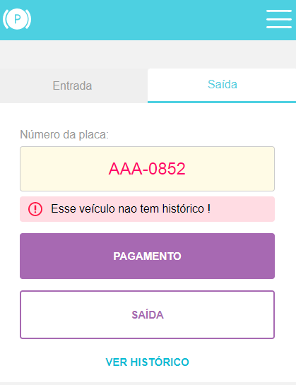

- Aplicação responsiva, feita do mobile first para o desktop.
- Usei como base as dimensões mobile l, 425x570.
- Hospedado na vercel: 
[Link do projeto](https://front-end-challenge-weslleysor.vercel.app/)

****
# Como iniciar o projeto

###### 1 - Instale o Node.js, caso não tenha.
###### 2 - Instale o yarn via powershell com o comando: `npm install --global yarn`
###### 3 - Ainda no powershell, digite `Get-ExecutionPolicy`, caso retorne "Restricted", digite `Set-ExecutionPolicy RemoteSigned` e depois escolha a opção "A".
###### 4 - Verifique se o yarn foi instalado corretamente digitando: `yarn --version`
###### 5 - Navegue até a pasta do projeto via powershell digitando: `cd <caminho até a pasta>`.
###### 6 - Instale as dependencias do **projeto** digitando: `yarn`
###### 7 - Para iniciar o projeto, digite `yarn dev`
###### 8 - Por padrão o projeto fica hospedado em `http://localhost:3000/`

****

  
Algumas imagens demonstrando mensagens de erro !

  
  ###### Veículo já esta estacionado:
  

  ###### Veículo já esta pago:
  

  ###### Veículo já saiu:
  

  ###### Placa inválida:
  

  ###### Veículo nunca entrou nesse estacionamento:
    

