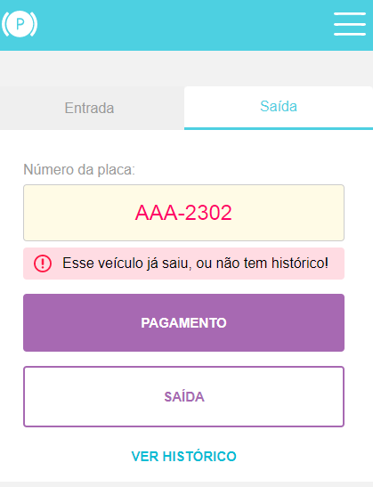

- Aplicação responsiva, feita do mobile first para o desktop.
- Usei como base as dimensões mobile l, 425x570.
- Hospedado na vercel:
  [Link do projeto](https://front-end-challenge-weslleysor.vercel.app/)

Versões utilizadas:

- Node: v16.14.2
- Yarn: 1.22.18

###### Algumas considerações sobre os errors:
- Ao fazer requisição para realizar o pagamento do estacionamento, mesmo se o carro já estiver pago, não tiver histórico ou já estiver saido, o código de erro retorna a mesma coisa **404 (Not Found)**, entao nao tem como diferenciar o pagamento efetuado de um carro que ja saiu ou que nao tem historico sem fazer uma gambiarra.

- O mesmo problema ocorre ao tentar fazer a saida de um veiculo do estacionamento, se o carro já saiu ou nao tem historico nao tem como fazer essa diferenciação entre as duas ocorrencias.

---

# 1. Como iniciar o projeto

###### 1 - Instale o Node.js, caso não tenha.

###### 2 - Instale o yarn via powershell com o comando: `npm install --global yarn`

###### 3 - Ainda no powershell, digite `Get-ExecutionPolicy`, caso retorne "Restricted", digite `Set-ExecutionPolicy RemoteSigned` e depois escolha a opção "A".

###### 4 - Verifique se o yarn foi instalado corretamente digitando: `yarn --version`

###### 5 - Navegue até a pasta do projeto via powershell digitando: `cd <caminho até a pasta>`.

###### 6 - Instale as dependencias do **projeto** digitando: `yarn`

###### 7 - Para iniciar o projeto, digite `yarn dev`

###### 8 - Por padrão o projeto fica hospedado em `http://localhost:3000/`

# 2. Realização de testes unitários.

###### 1 - Após a instalação das dependencias do projeto com o `yarn`, utilizar o comando: `yarn test`

  
Print do teste depois de concluído. ( Atualmente os testes estão em construção )

  

---

###### Algumas imagens demonstrando mensagens de erro

  
Veículo já esta estacionado ( Ao tentar dar entrada de um carro que ja está estacionado )

  

  
Veículo já esta pago ( Ao tentar realizar o pagamento, mesmo tendo pago )

  
  

  
Veículo não esta pago ( Ao tentar realizar a saída sem pagar )

  
  

  
Veículo já saiu ( Ao tentar realizar a saída já tendo saido. )

  
  

  
Placa inválida ( Ao tentar realizar requisição com uma placa invalida )

  
  

  
Veículo sem histórico de entradas ( Ao tentar ver o histórico de um carro que nunca entrou no estacionamento )

  
  

